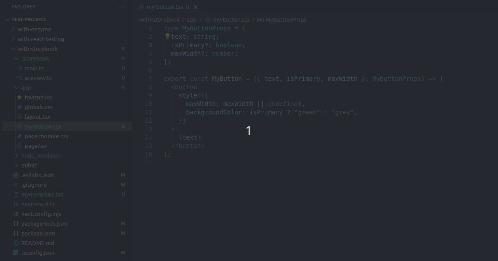

# Add Story

This VS Code extension allows for you to create a Storybook story for a client by just right-clicking on the component file and selecting Add Story:

<a href=".public/use-add-story.gif"></a>

## Settings

You can choose whether to have the arguments for the story added or not. This extension will try to map the properties to the type when creating the args, but in case you don't want them, please uncheck the **Should Add Args To Story** option.

If you want to have your own template for the created story rather than the default one used by this extension, you can set it by opening the Visual Studio Code command-menu (ctrl+ctrl) and run the command **Add Story Template Path**, which will allow for you to select the file you want to use.
To create a template, you can use the following template keys:
* `$componentName` This will be replace by the name of the component
* `$componentPath` This will be replace by the path to the component
* `$componentArgsWithTypes` These are used to add the arguments with their types (such as `name: string`)
* `$componentArgsWithValues` These are used to add the arguments with a default value (such as `name: ""`)

The default template looks like this:

```ts
import type { Meta, StoryObj } from "@storybook/react";

import { $componentName } from "$componentPath";

const meta: Meta<typeof $componentName> = {
  component: $componentName,
  args: {
    $componentArgsWithTypes
  },
};

export default meta;

type Story = StoryObj<typeof $componentName>;

export const Primary: Story = {
  args: {
    $componentArgsWithValues
  },
  render: (args) => <$componentName {...args} />,
};
```

## Contributing

If you want to contribute, please visit the repo over at [GitHub](https://github.com/Morkalork/add-story). Either add an issue or create PR!

## Development

To work with the repo, please start by installing the local dependencies (`npm install`). After that you can just launch the extension using F5 and try it out.

## How do I publish a new version?

Bump the version in package.json and run the following command:

```bash
# Build the app in /dist
npm run build

# Publish it to npmjs.org
npm publish --access public

# Tag it
git tag -a vX.XX -m "What have you done!?"

# Push (preferably a branch and not main)
git push origin main

# Push it all
git push origin --tags
```